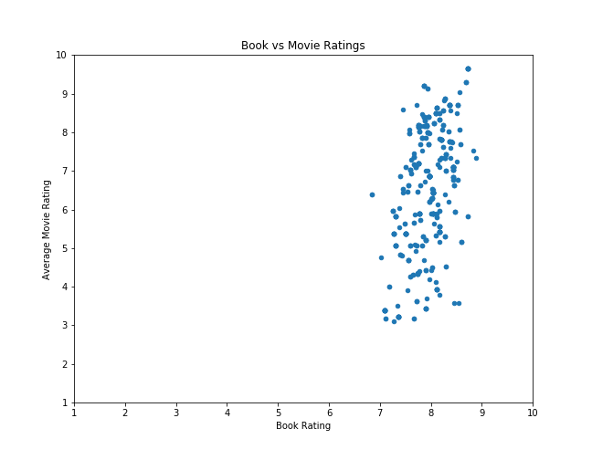
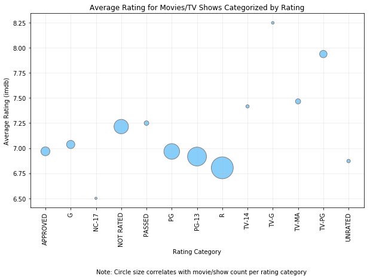
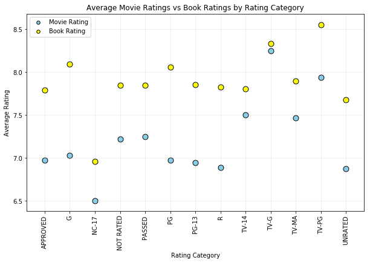
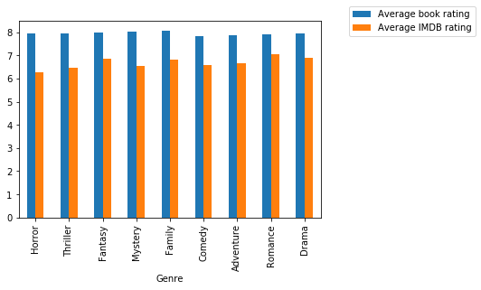
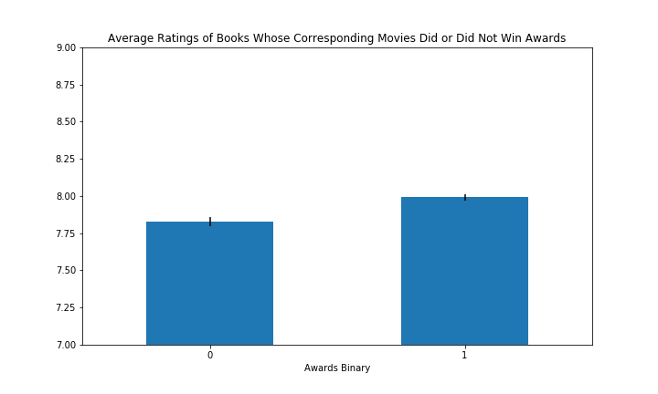

# ETL-project: Books That Became Movies

## Motivation

We were curious about how ratings of books compared to ratings of movies, particularly for movies based on books. To make a dataset that answers this question, we downloaded book review data from GoodReads book reviews and queried movie review data from the oMDB API. We then joined these databases together to create a dataset of books that were made into movies. Using this dataset, one can determine which books were rated highly but their movies were not, or vice versa. Additionally, since we obtained the genre of each book/movie, we performed an analysis by genre to determine whether one particular genre had better ratings than another. We were also able to analyze whether books whose movies had won awards were rated more highly than books whose movies had not won awards. Finally, we uploaded this dataset to MongoDB to allow others to perform their own analyses.

## Extraction

We used two sources of data. The first was a Kaggle dataset of book reviews from the website GoodReads. This was formatted as a (very large) CSV file that we downloaded and loaded into Pandas. The second was the oMDB API, an open movies database that references iMDB. We filtered out books that have more than 100,000 ratings and chose the first 2000 books from that list. We then queried the oMDB database by each unique book title. Next, we joined the book ratings to the movie ratings in a single combined Pandas dataframe before beginning to clean, transform, and analyze the data.

## Transformation/Analysis

After requesting data from the movie database, we realized that the movie ratings and book ratings were on different scales, so we multiplied them for easier comparison. Furthermore, because three different movie scores (iMDB, Metacritic, and Rotten Tomatoes) were returned, we created a new column called “Average Movie Rating” that took the average of all three movie scores. We made several new dataframes, grouped by different variables, in order to perform different analyses on each variable. These analyses are detailed below.

### Book vs Movie Ratings Overall

We created a scatter plot of average movie ratings (averaged across all three movie rating scores) and book ratings. As shown in the above graph, ratings of books were generally high, with all values above 6. Meanwhile, the ratings of movies varied much more wildly. This suggests that only good books were adapted as movies; however, the resulting movies were not necessarily good.

### Movie Rating (R, PG, etc)

We grouped the movie ratings based on their rating categories to analyze which categories tend to have higher reviews. According to the plot, books that were adapted to TV-Series have higher average ratings than books that were adapted to movies. However, we have to note that the number of TV-Series are a lot lower than the number of movies.

From the scatter plot above, we can see that all the books have a higher rating than their movie/TV-Series adaptations with the biggest difference being in G and PG categories. Books that were adapted into TV-Series generally have a smaller gap between their ratings compared to the movie adaptations. 

### Genre

These nine genres appear in more than a hundred of the movies in our dataset. We first filter out all the nan values, then we calculate the average rating for each genre. From the above graph, we can see that, on average, book ratings are higher than the movie rating(IMDB rating). The difference between the average book ratings and the average IMDB rating lay between 1.665 and 0.887.

### Awards

We were interested in determining if there was a relationship between book ratings and whether or not the book’s corresponding movie had won an award or not. To determine whether or not a movie won an award, we analyzed the “Awards” column of our data. If the “Awards” column contained the word “won” or “win”, a value of 1 was added to a new column; if it did not, a value of 0 was added. We then grouped by that new binary column and found the average book rating of each group. The above bar graph shows the average book rating where the movie did or did not win an award. We added error bars to add context to any differences between the ratings. We observed that the books whose movies had won awards had slightly, but significantly, higher ratings than those whose movies had not won awards. This measure shows that book ratings are related to movie success, to some extent.

## Load

We decided to load our data in MongoDB, a non-relational database. We made this decision due to the fact that much of our data came from the oMDB API, which sometimes returned different values in the JSON attributes, or different attributes entirely, depending on which movie was being queried. As a result, it was difficult to predict whether each API response would have the same JSON structure. For this reason, we decided to use MongoDB, which allows each individual document to have different attribute-value pairings if necessary. Although we tended to use the attributes for which the majority of responses had valid values, MongoDB offers a greater amount of schema flexibility compared to a relational database.

We stored the output data in in CSV files and loaded them into different MongoDB collections using PyMongo.

## Data Limitations

There were several limitations of querying with the oMDB database. First, each request only returned one movie, even if there were multiple movies with the same name. Second, we made an assumption that the movie that was returned was based on the book, even though it could have been totally unrelated to the book or the book could have been based on the movie. Furthermore, we found when comparing the movie and book ratings that the iMDB rating was on a scale of 10, whereas the GoodReads rating was on a scale of 5. However, we were easily able to multiply the GoodReads ratings by 2 for better comparison.

## Built With

* Python (Pandas, requests, matplotlib)
* [Goodreads reviews (Kaggle dataset)](https://www.kaggle.com/gnanesh/goodreads-book-reviews)
* [oMDB API](http://www.omdbapi.com)
* MongoDB and pymongo

## Authors

* Hong Li
* Htet Linn
* Arley Schenker